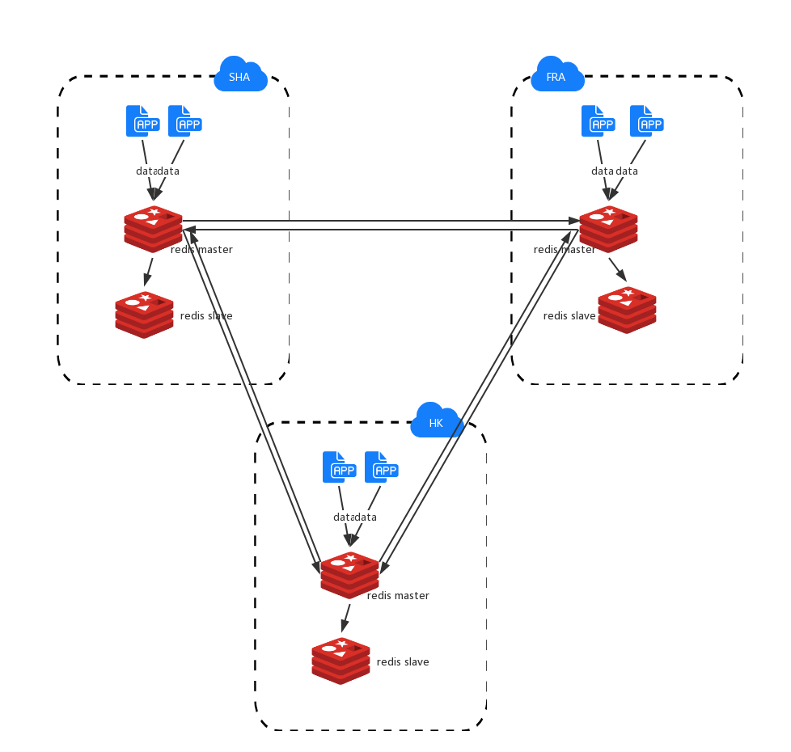

* 每个站点的 redis 独立向本站点提供服务, 即使其他站点的Redis服务不可用, 也不会影响本站点的Redis持续提供对外的服务. 

* 不同的站点之间, 我们采用网状的拓扑结构 -- mesh topology进行部署(如下图), 不同站点的Redis之间通过Peer Replication完成数据的相互交流, 应用只需操作本站的Redis, 而不用担心数据同步问题以及并发同步的冲突问题.
 