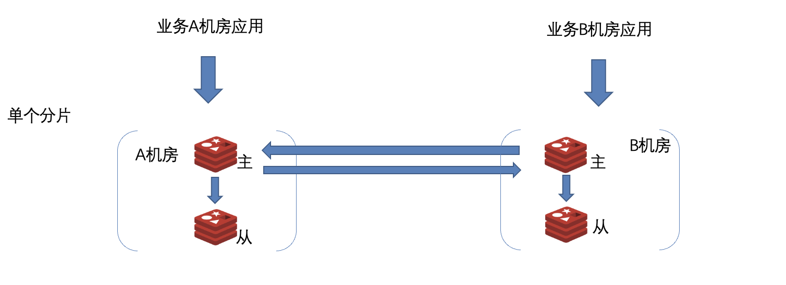
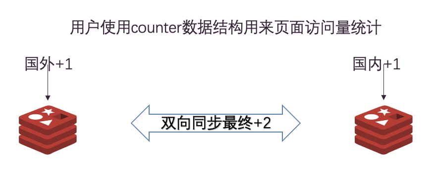
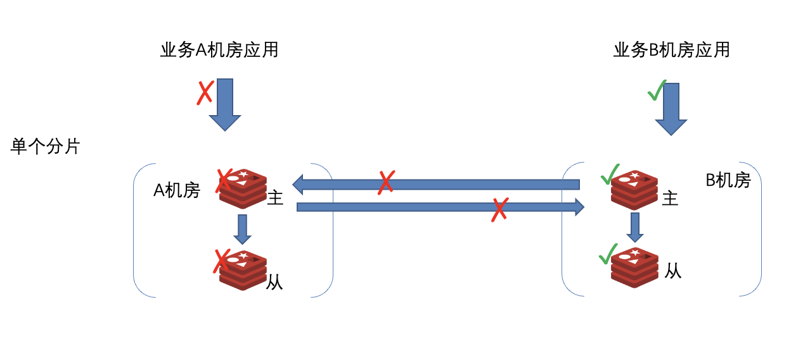

### 双向同步Redis数据库
  双向同步redis数据库是一款支持本地写入且能自动解决数据冲突的分布式数据库，可以大大降低用户应用上云的改造成本。 
    1. 用户可以就近访问数据库（提高读写性能） 
    2. 用户不需要关心数据冲突（简化用户逻辑） 
    3. 其他机房故障时，不会影响到本机房正常使用（提高用户集群可用性） 

  

#### 可就近访问

  每个机房都会有自己的mater和slave，可提供读取和写入操作。 

  

#### 同步解决冲突

  当多机房使用操作相同key造成数据冲突时，通过使用[CRDT数据类型](https://en.wikipedia.org/wiki/Conflict-free_replicated_data_type)来解决数据一致性问题。 
  目前Redis常用数据类型（kv，hash，set，sortset）已经实现CRDT数据类型。

  

#### 其他机房故障无需切换
    
  即使双向同步的其他机房都发生故障，也不会影响本机房正常的读取和写入，无需DR切换。 
   
  

  当公司演练时,xpipe单向同步集群需要切换主机房,会存在丢失部分写入数据的风险（重要的数据可能演练结束之后需要用户重新补充）,而双向同步集群演练结束之后会将数据重新同步上。
  
-------
[CRDT数据结构相关资料](原理/crdt资料.md)
