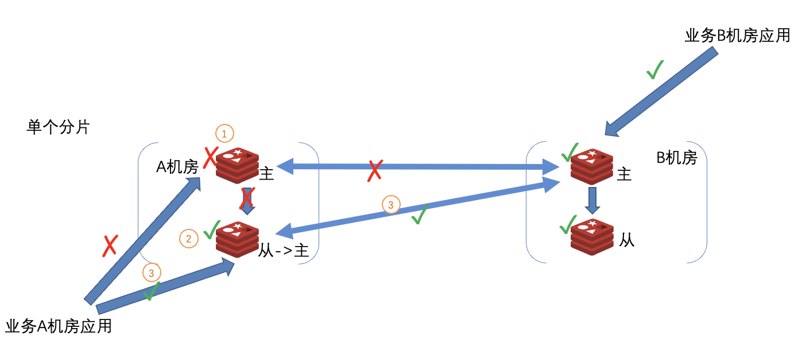
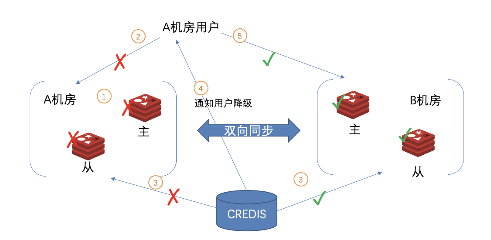

### 双向同步集群高可用

Redis服务端发生故障时，系统自动恢复Redis的可用状态（无需人工干预)。
1. 机房内单个redis故障
2. 机房内全部redis故障
3. 机房故障（包括用户应用）

#### 机房内单个redis故障

1. 机房内master故障
2. 哨兵触发主从切换
3. redis恢复可用 （故障到恢复用户报错最多持续35s)
   1. credis客户端路由切换 
   2. xpipe调整双向复制关系

#### 机房内全部redis故障

1. 机房内所有master故障
2. credis客户端路由切换到其他可用机房

#### 机房故障（包括用户应用)

1. 不会影响到其他机房调用