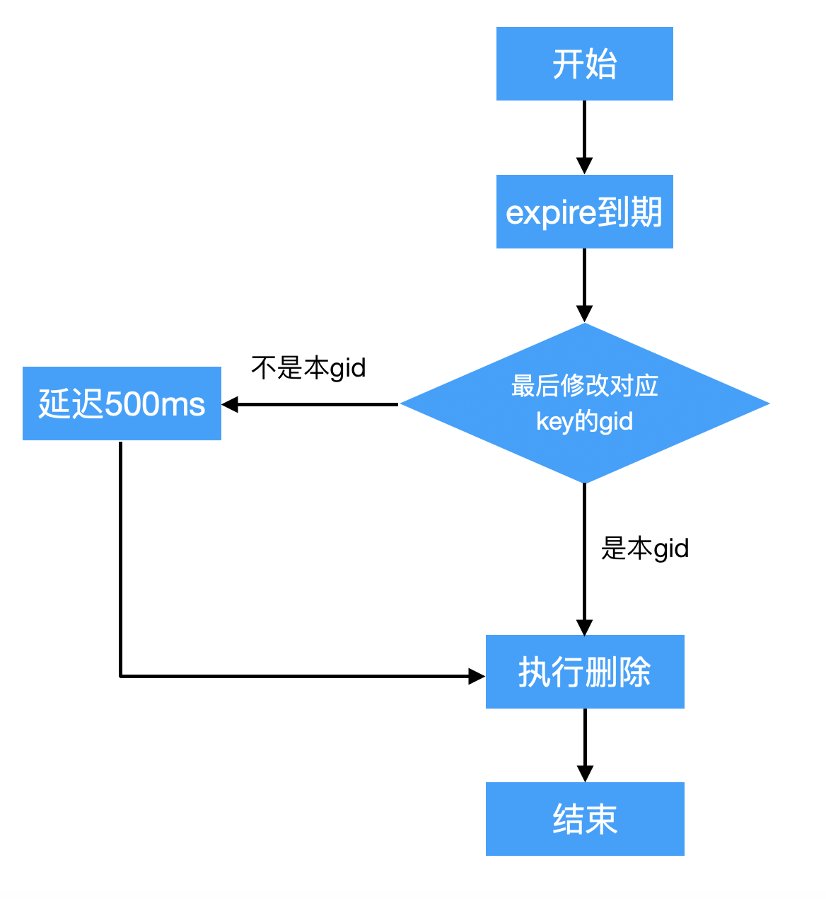

### 设计说明

本版设计的expire：

1. **保证数据**的**最终一致性**
   1. expire只会在转化为delete命令后影响数据的一致性，而我们保证expire转化成的delete一定会执行并广播给其他同步节点，因此数据是最终一致的。
2. **不保证expire**的**一致性**
   1. 为了达到**节省内存的**目的，我们**放弃了expire的一致性。**因为expire的一致性需要额外的存储信息进行处理，所以会造成内存使用量的大量增加。由于expire不一致不会影响数据的一致性，所以我们认为即使expire不一致也是可以接受的。

相关说明：

1. 关于数据的最终一致性说明
   1. 数据一致性指的是在没有数据更新操作时，不同的同步站点的数据及状态是相同的。
2. 关于expire的不一致说明
   1. 用户在不同站点执行expire命令后，不同站点的expire的过期时间可能不一致。

#### expire不一致场景举例：

场景1. 同时收到expire和persist命令

说明：在t4时间点，gid1和gid2、gid3的expire出现了不一致，但是最终（t5）的数据是一致的。

| 时间线/gid | gid1                               | gid2          | gid3         |
| :--------- | :--------------------------------- | :------------ | :----------- |
| t1         | setex 1000 k v                     |               |              |
|            | sync                               |               |              |
| t2         |                                    | expire k 2000 |              |
| t3         |                                    |               | persist k    |
|            | sync                               |               |              |
|            | 先收到persist k后收到expire k 2000 |               |              |
| t4         | ttl k => 2000                      | ttl k => -1   | ttl k => -1  |
|            | 等待2000秒                         |               |              |
| t5         | get k => nil                       | get k => nil  | get k => nil |

场景2. set命令,del命令 以及hdel删完hash时expire不一致的情况

说明：crdt.set和crdt.expire执行顺序不同导致expire的不一致

|      | A             | B              | C                                                            |
| :--- | :------------ | :------------- | :----------------------------------------------------------- |
| t1   | set k v       |                |                                                              |
| t2   |               | expire k 1000  |                                                              |
|      | sync          |                |                                                              |
|      |               |                | 先收到crdt.expire后收到set k v当没有值的时候,收到的expire是否保存问题(原生redis的方法里是没有数据不能设置expire的,同时expire的key是复用的数据的key) |
| t3   | ttl k => 1000 | ttl  k => 1000 | ttl k => -1                                                  |
|      |               |                | 只要最后有节点执行expire转换成delete 数据就是最终一致的      |
|      | 等待1000秒    |                |                                                              |
| t4   | get k  => nil | get k => nil   | get k => nil                                                 |

场景3:最后修改值的节点和expire的节点不同的情况

说明：设置expire的节点与最后修改值的节点不同，当其他节点与这两个节点同步时可能导致expire遗漏

|      | A             | B              | C                                                            |
| :--- | :------------ | :------------- | :----------------------------------------------------------- |
| t1   |               |                | peerof A                                                     |
| t2   | set k v       |                |                                                              |
|      | sync          |                |                                                              |
|      | get k => v    | get k => v     | get k => v                                                   |
| t3   |               | expire k 1000  |                                                              |
|      |               |                | peerof B（由于最后修改k值操作的是A节点,  所以C与B进行全量同步不会发送k的值和expire) |
|      | sync          |                |                                                              |
| t4   | ttl k => 1000 | ttl  k => 1000 | ttl k => -1                                                  |
|      |               |                | 只要最后有节点执行expire转换成delete 数据就是最终一致的      |
|      | 等待1000秒    |                |                                                              |
| t5   | get k  => nil | get k  => nil  | get k  => nil                                                |

场景4:与场景3类似

|      | A             | B             | C                                                            |
| :--- | :------------ | :------------ | :----------------------------------------------------------- |
| t1   | set k v       |               |                                                              |
| t2   |               |               | peerof A                                                     |
|      | sync          |               |                                                              |
| t3   |               | expire k 1000 |                                                              |
| t4   |               |               | peerof B（由于最后修改k值操作的是A节点,  所以C与B进行全量同步不会发送k的值和expire) |
|      | sync          |               |                                                              |
| t5   | ttl k => 1000 | ttl k => 1000 | ttl k => -1                                                  |
|      |               |               | 只要最后有节点执行expire转换成delete 数据就是最终一致的      |
|      | 等待1000秒    |               |                                                              |
| t6   | get k  => nil | get k  => nil | get k  => nil                                                |

### expire数据结构设计

#### 数据结构说明及设计图

我们保持了原生redis中expire的数据结构设计，即保持使用一个long long类型的时间戳存储expire。

数据类型：long long (gcc)

内存占用大小：64个bit（8个字节）

使用方式：存储expire设置的时间戳（同原生redis一样）

### expire处理流程

#### 设计说明

1. ##### 对于相同gid的expire命令，采用直接覆盖策略

   1. 如果是相同gid的expire命令，则说明是用户执行的，对于用户执行的命令应该是无条件确保的

2. ##### 对于不同gid的expire命令，采用比较取最大策略

   1. 对于不同gid的expire命令，由于在当前设计下无法比较各个节点执行命令的顺序，所以只能采取取最大、取最小或覆盖的策略，我们最终采取了取最大策略
      1. 如果采取取最小或者直接覆盖，那么可能出现较小的expire覆盖较大的expire的情况，最终导致expire过早过期，不符合用户预期

#### 处理流程示例

|      | A                          | B                              |
| :--- | :------------------------- | :----------------------------- |
| t1   | setex 1000 k v             |                                |
|      | sync                       |                                |
| t2   | ttl k=> 1000               | ttl k=> 1000                   |
| t3   |                            | expire k 10 (以本地优先最高级) |
|      | sync                       |                                |
| t4   | ttl k => 1000 （取最大值） | ttl k => 10                    |
| t5   | 等待 10秒                  |                                |
| t6   | get k => nil               | get k => nil                   |

### expire到期删除

#### 设计说明

1. expire到期删除时可能会有多个站点广播相同的delete命令，对redis性能造成一定影响。
   1. expire到期执行删除时，会转化为delete命令同步给双向同步的节点。考虑到如果短时间内有多个同步节点都需要执行expire的删除操作，则同步的其他节点会执行多次delete操作。为了性能考虑，当前节点如果不是最后修改对应key值的节点，那么在执行expire的到期删除时会延迟500ms执行，在此期间如果接收到其他同步节点的delete命令，那么延迟执行的delete命令不再会重复执行。

#### 操作流程

expire到期执行删除时，首先判断最后修改对应key的gid是否是本gid，如果是则直接执行删除，否则延迟500ms后执行。

