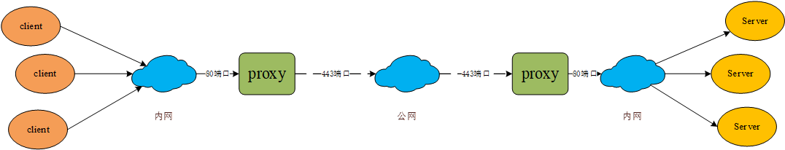

# 问题

**国内和海外机房的网络无法直连**

# 解决方案

## 方案1

搭专线

### 成本

| 国家 | 国家     | 价格          |
| :--- | :------- | :------------ |
| 上海 | 法兰克福 | 4000usd/month |

其他线路具体价格 找Ramon Ren (任文灏) 咨询

### 问题

如何用上专线

1. 理论上：只需要把使用上专线的集群 迁移到固定的宿主机（特定vpc或者特定网段的机器上）
2. 现实上：aws 法兰克福 并没有使用到专线  
   1. 具体实施起来 还有什么问题不确定

对现在的流程有啥影响

1. 理论上redis不需要做什么修改. 只需要确保宿主机网络即可
2. 具体实施起来 还有什么问题不确定

### 适合用户

对网络延迟和网络稳定性要求较高的用户 可选用专线

## 方案2 

通过xpipe-proxy 搭建公网代理的方式解决

### 适合用户

适合大部分用户和场景.通用解决方案

### 协议

peerof  <peer_gid> <peer_host> <peer_port> proxy-type XPIPE-PROXY proxy-servers PROXYTCP://<host:port,...> proxy-params <[PROXYTLS://host:port](proxytls://hostport),...>

### 协议举例

比如A 机房 redis  1.1.1.1(6379)  A机房的代理 2.2.2.2(tcp 80 tls 443)  B机房的redis 3.3.3.3 (6379) B机房的代理 4.4.4.4 (tcp 80 tls 443)./redis-cli -h 1.1.1.1 -p 6379 peerof B 3.3.3.3 6379 proxy-type XPIPE-PROXY proxy-servers PROXYTCP://2.2.2.2:80  proxy-params [PROXYTLS://4.4.4.4:443](proxytls://4.4.4.4:443)

## 具体实现（关于方案2的实现)

1. ### redis

   1. 新增xpipe-proxy-peerof 命令 （为了以后可以接入更多类型的代理,并且可能连接不通peer使用的代理不同 参数可能不同) 
      1. 需要修改数据结构
         1. CRDT_Master_Instance 新增属性
            1. proxy-type: int （如果没有proxy的话 就NO_PROXY 0)
            2. proxy: void*
      2. 暂时没办法做成module的原因是
         1. 没有办法直接引入module 从而影响到同步全量同步前的逻辑 
         2. 如果需要的话 这样需要引入proxy的一个概念（类似于robj中有 redismodulevalue这样的一个概念可让用户扩展）再加载module后注册proxy对象的实现 
         3. 需要定制 先加载module 后加载 config 以及需要支持config 读取命令可以动态添加 等等
   2. peerof命令 增加判断如果有proxy属性的话 清理proxy 和proxy-type 
   3. crdt.info 命令需要增加显示proxy 类型和 proxy 连接的地址
   4. 添加保存和读取配置文件逻辑
   5. 添加保存和读取rdb逻辑
   6. crdtConnectWithMaster函数内增加代理逻辑
      1. ctrip-proxy
         1. proxy 对象属性
            1. servers : sds[] 
            2. servers-len: int (代理数组的长度)
            3. servers-index: int (当前使用第几个proxy-servers)
               1. 如果proxy-servers PROXYTCP://连接失败会增加proxy-servers-index
                  1. 就是每次尝试连接一次 如果失败 通过redis机制下一轮连接尝试下一个proxy-servers
                  2. 如果proxy-servers-index ==  proxy-servers-len 重置为0
            4. proxytls: sds 这里不校验字符串的正确性
         2. 连接上proxy-servers后执行
            1. +PROXY ROUTE {PROXYTLS:{proxy-params}}  TCP://{host}:{port}
            2. 之后继续执行crdtSyncWithMaster
         3. 核心指标
            1. 网络延迟

2. ### credis (迁移和搭建)

   1. 创建双向同步集群（跨公网的搭建） 和xpipe单向同步集群迁移
      1. 创建集群时 增加代理选项 
      2. xpipe单向同步集群的话 需要识别出有代理
      3. AWS机房的话
         1. 调用参数修改 idc = FRA-AWS
      4. 需要从xpipe 拿proxy信息 (设置ctrip-proxy-peerof使用）
      5. 国内console连接海外的redis 
         1. 方案1  通过海外的metaserver 对海外redis执行命令

3. ### xpipe 

   1. 需要确定是否能自动识别出redis是否增加了代理 然后显示到页面上
      1. 方式1 通过proxy MONITOR SocketStats 查看所有的ip和port 找到对应的redis 
      2. 方式2 通过redis  crdt.info replication (会有proxy信息)
   2. 需要自动调整peerof命令
      1. 检查peerof是否正确 逻辑需要修改
      2. 需要执行peerof 的时候 逻辑需要修改

# 参考资料