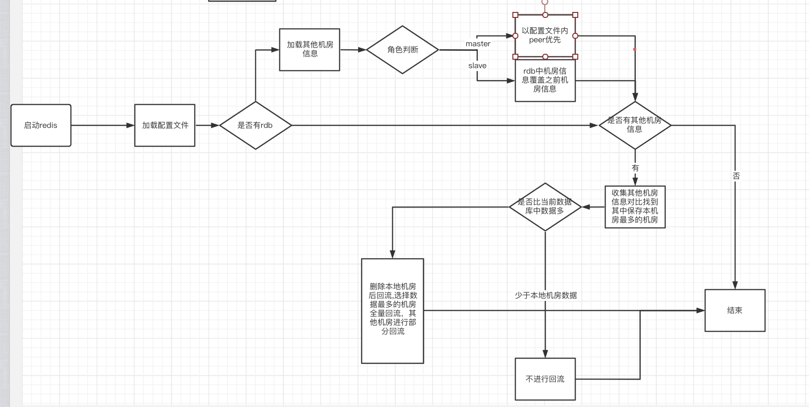

# 背景

1. CRDT-Redis（双向复制）的基本功能已经开发完毕，后续支持核心集群接入（影响订单）。
2. 基于CRDT-Redis（双向复制）的特性，机房故障时，其他机房不受影响。（无需DR切换）
3. 机房故障恢复后，需要制定一个还原（将故障的机房恢复成原样，并重新投入使用）方案。
4. 极低概率可能发生单边机房CRDT-Redis主从全挂的情况，这种情况也要能由该方案解决。

# 目标

故障机房重新拉入集群，各机房数据最终达成一致，非故障机房的数据不丢，故障机房数据尽量不丢（并不保证数据完全还原）

非故障机房尽量不受影响

最终各机房高可用能力恢复

最终各机房客户端就近读写

作为保底流程，确保尽可能成功，速度不用特别快

# 具体目标

Redis重启后，数据自动恢复，复制关系自动恢复

哨兵能自动恢复

客户端路由指向能自动恢复

# 具体实现

1. 双向同步需要支持回流

   1. 什么情况下应该回流？

      1. Master的本机房数据少于peer的本机房数据时自动回流
         1. 什么时候会少于peer
            1. 当redis重启时，内存数据丢失，可能会少于其他机房
               1. 有可能存在rdb加载后数据完整的情况
            2. 当slave翻成master时 （可能存在数据不一致)
               1. 不进行回流 
                  1. 出于对用户体验的考虑（回流时用户不可写）
                  2. 默认master-slave之间同步数据比master-peer之间同步的要快 (master-slave同机房传播比跨机房传播慢 是个极低概率发生的事情)
         2. 不少于peer的时候
            1.  断网不会少于
                1. 客户端和Master断网，本机房不会写入新数据
                2. Master和Peer断网，本机房新数据不会复制到peer
      2. 人工命令执行回流 （主要依靠人为判断来决定需要回流)
         1. 指定机房进行数据回流 

   2. 从哪回流

      1. 从peer回流

         1. 怎么知道peer信息

            1. 可以读取配置文件内获得peer的信息

            2. 可以加载rdb之后获得peer的信息

            3. 优先级

               1. master优先使用配置文件中的peer信息，slave优先使用rdb（相当于slave以master的信息为准）

            4. 如果peer信息有问题 

               (xpipe能自动调对peer  1分钟一次)

               1. 有什么影响 
                  1. 连接的是不存在的peer后被调对
                     1. 会一直尝试回流 。由于机制不可读不可写，不会产生脏数据
                  2. 如果是连接一个其他集群的redis
                     1. 同步时会验证信息，peerof会一直失败 和上面同理
                  3. 连接到peer的slave上
                     1. xpipe自动调整
                        1. 在回流完成前 
                           1. 并不会产生影响 只需要xpipe重新调整,并让其执行回流即可
                        2. 在回流完成后
                           1. 可能会存在影响:
                              1. 由于slave的数据比master少 导致回流不完全数据
                           2. 由于发生概率低 可忽略 (先要peer信息错误,再要master同步给slave比重启连接慢)
               2. 如果xpipe 失效
                  1. 可人工执行peerof命令
               3. 如何确保xpipe调整时 也进行自动回流
                  1. 出于希望redis的并不引入新机制的考虑, 选择方案1 
                  2. 方案1 xpipe自动判断是需要回流的

         2. 怎么回流 ？

            1.  对所有peer都执行回流操作, 合并所有peer的回流数据来确保数据的完整
                1. 合并时根据冲突处理策略 先判断逻辑时钟，再根据时间戳, 最后机房id 

   3. 需要回流哪部分数据 (原则：回流大于本地进度的数据)

      1. 出于对性能以及优化回流资源消耗方面考虑 
         1. redis重启的话 
            1. 没有rdb从0开始回流
            2. 有rdb的情况
               1. 加载rdb内数据 收集其他peer上的本机房的逻辑时钟 
                  1. 如果其他机房中本机房的逻辑时钟大于rdb中的逻辑时钟,清理掉rdb数据后进行全量回流
                  2. rdb中的逻辑时钟大于其他机房的vectorClock的话 就进行不进行回流.
         2. 人工回流的话 可指定开始回流的vcu

   4. redis在回流过程中处于不可读不可写状态 （参考redis加载rdb时不可写不可读状态） 

      1. 为什么回流过程中不可读不可写？
         1. 不可写（优先级高)
            1. 为了保证在回流过程中 数据的安全性考虑 
         2. 不可读 （优先级低)
            1. redis服务器主要控制致命的错误,其他可以通过credis服务器端来控制 
            2. 选择不可读的原因
               1. 不引入新概念（参考redis加载rdb时的状态) 
      2. 和rdb加载时有什么区别？
         1. 需要对对部分写操作进行白名单 （redis本身的机制就有 不需要增加额外的概念)
            1. 由于回流是基于peerof全量同步模型基础上增加的功能 需要写操作的 
            2. 回流时使用的是crdt前缀的命令.credis客户端并不支持 所以我们同步命令过程中是安全。
         2. redis状态为回流时credis需要转移redis读写流量（出于回流过程中不可读不可写状态 对用户使用的影响来考虑 ) 
            1. 由于在master加载rdb时不可读不可写的状态时,哨兵不会做任何处理. 
            2. 所以外部需要有定期检查程序进行判断是否正在回流 如果是的话需要转移流量
               1. 是否需要转移流量？（用户是否可接受)
                  1. 好处 用户不会报错
                  2. 坏处 读写网络延迟增加 
               2. 方案: xpipe监控当前状态是否回流，来调用credis接口改变状态,从而credis根据读写策略来转移应用流量
      3. 在回流的时候 无法给其他peer同步数据
         1. 原因: 自己本身就没数据 只有等回流完成后才能同步给其他peer
         2. 影响: 当2个机房同时需要回流的时 会造成死锁
            1. 暂时解决方案： xpipe监控发现同时多个机房在回流时报警,人工处理.

   5. 回流 

      1. 回流和同步合并进行的设计方案

         1. 启动后读取所有机房信息后,给所有机房都发送查询本机房进度的信息

         2. 对比后选择进度最大的机房进行全部回流,其他进行部分回流

            1. 举例子

               1. 比如A在B机房的进度90,A在C机房的进度100, A会从C机房回流从0到100的进度, 从B回流100的进度

               2. |      | B（90）                 | C（100） |
                  | :--- | :---------------------- | :------- |
                  | t1   | null(回流是从100开始拿) | 0-100    |

         3. 需要确认哨兵没有调整状态后执行回流和同步

         4. 中途xpipe调整状态的情况 （继承之前回流状态 即A正在向B进行回流，xpipe调整A指向B2的话，那么A将向B2进行回流)

            1. xpipe调整最大机房（C）

            2. 1. 进度变大

                  |      | B（90）                 | C（100） | C2（110） |
                  | :--- | :---------------------- | :------- | :-------- |
                  | t1   | null(回流是从100开始拿) | 0-100    |           |
                  | t2   | xpipe把C调成C2          |          |           |
                  | t3   | null                    |          | 0-110     |

               2. 进度变小（会存在丢数据情况)

                  |      | B（90）                   | C（100） | C2（80） |
                  | :--- | :------------------------ | :------- | :------- |
                  | t1   | null(回流是从100开始拿)   | 0-100    |          |
                  | t2   | xpipe把A连接到C上的调成C2 |          |          |
                  | t3   | null                      |          | 0-80     |

            3. xpipe调整其他机房 （B）

               1. 进度变大

                  |      | B（90）                     | C（100） | B2（110） |
                  | :--- | :-------------------------- | :------- | :-------- |
                  | t1   | null(回流是从100开始拿)     | 0-100    |           |
                  | t2   | xpipe把A连接B上的回流调成B2 |          |           |
                  | t3   | null                        | 0-100    | 100-110   |

               2. 进度变小

                  |      | B（90）                     | C（100） | B2（80） |
                  | :--- | :-------------------------- | :------- | :------- |
                  | t1   | null(回流是从100开始拿)     | 0-100    |          |
                  | t2   | xpipe把A连接B上的回流调成B2 |          |          |
                  | t3   | null                        | 0-100    | null     |

         5. 只有当所有机房的回流和同步都完成后,才会解除回流状态(用户可用）

   6. 具体回流的步骤（基于上述的回流和同步合并的解决方案）

      1. |      | master                                        | peer            |
         | :--- | :-------------------------------------------- | :-------------- |
         | t1   | master建立和peer的连接,中间流程和同步过程一样 |                 |
         | t2   | 发送CRDT.REPLCONF命令增加回流标记             |                 |
         |      |                                               | 返回ok          |
         | t3   | 发送CRDT.PSYNC                                |                 |
         |      |                                               | 返回+FULLRESYNC |

      1. 同步过程中 , 当多个机房来请求全量同步 复用同一个全量同步的数据 发送给多个机房

         1. 结论保持原来模型
         2. 由于双向同步的redis是保证了同步操作是幂等的, （执行多次同步也不会影响数据最终一致）即使不需要回流的机房接收到了回流数据也不会影响数据最终一致

   7. 哨兵能自动恢复 

      1. xpipe哨兵监控 （xpipe定期检查如果没有哨兵会自动添加哨兵)

   8. 客户端路由指向

      1. 读写策略降级 （优先级高)
         1. 单机房单分片内master和slave都挂的情况
            1. 当master和slave都挂了，credis会将读写策略降级到另外的可用机房，当前机房的应用能正常读写 （哨兵检测到master和slave挂)
            2. 当master和slave恢复后，读写策略能恢复到原机房。(哨兵检测到master和slave恢复）
         2. 单机房内有双向同步的master正在回流时
            1. 正在回流的机房内credis会将客户端读写策略降级到其他可用机房 （credis服务端会监控master回流状态的改变,会主动推送消息给客户端)
            2. master恢复正常之后,读写策略能恢复到原机房 (credis服务端监控master回流状态的改变,会主动推送消息给客户端)
      2. xpipe手动切机房 （优先级低)
         1. 场景举例 （降级策略不符合预期时人工选择)
            1. 多机房 其中一个机房的redis挂了,由于降级策略导致可能分配到一个网络延迟较高的机房 需要人工介入指定机房
         2. 结果
            1. 有能力把不可用的机房内redis访问流量指向指定的可用机房 （集群级别的)
         3. 优先级较低的原因
            1. 现在只有双机房 所以就算指定机房也只有另外一个机房

   9. 数据回流是否一定能还原到最终数据 

      1. 并不保证数据一定能还原到完整
         1. 举例: redis启动时peer信息是缺少的, 之后通过xpipe增加上的 （可能导致回流上的数据只是部分或者没有)

# 代码实现的改动：

### xredis双向同步代码修改

1. 需要支持配置文件 保存和读取peer信息

   1. 读取配置文件和加载rdb的peer信息 优先级 
      1. 加载rdb时 
         1. 启动时 （master和slave)
         2. master-slave全量同步时 (slave）
         3. debug(reload)命令重新加载rdb 
      2. 加载配置文件时
         1. 启动时加载配置文件

2. 全量同步过程支持回流，

3. 1. 修改peer流程增加回流协议,返回判断同步类型时增加回流判断 
   2. 全量同步中支持回流
   3. 回流开始前设置不可读不可写，回流完成后恢复

4. 启动后选择进度最高的机房后 设置回流

   1. 进度最高的机房回流从0开始，其他机房从最大进度开始.

5. 重启后等待哨兵调整状态之后再操作 

   1. 实现:（redis重启后延迟一段时间后再能进行连接其他机房）

### credis代码实现

1. 需要增加路由降级策略
   1. 如果某机房master和slave都挂了,需要下发其他机房的master和slave信息给客户端
      1. 如果某机房master处于回流状态中,同样需要下发其他机房的master和slave信息给客户端
         1. 需新增状态
2. 定时检测双向同步集群的master的回流状态
   1.  回流状态修改对应的状态(推送给客户端)

### xpipe代码修改

1. 新增双向同步集群的回流状态监控
   1. 发现再回流 (报警)

### 问题:

1. 以前逻辑,如果有rdb的话 会加载rdb后进行部分回流 （基于rdb中数据,为了减少回流的数据量 只回流大于本地机房vectorClock的部分) 导致加载老的rdb（rdb中可能保存部分已经删除的数据) 最终进行回流机房的数据比其他机房的多

| 时间 | A机房                            | B机房                 |
| :--- | :------------------------------- | :-------------------- |
| t1   | set k v                          |                       |
|      | sync                             |                       |
|      | get k=>v                         | get k=>v              |
| t2   | save rdb                         |                       |
| t3   |                                  | del k                 |
|      | sync                             |                       |
|      | get k=> nil (且gc掉了)           | get k=> nil(且gc掉了) |
| t4   | 出现故障自动恢复时,重启并加载rdb |                       |
|      | 回流完成                         |                       |
|      | get k=> v                        | get k=>nil            |

### 解决方案:

重启加载rdb之后. 查询其他机房中本机房的vectorClock 找到最大的vectorClock 与当前rdb中的vectorClock进行对比

如果其他机房中最大的vectorClock大于当前的vectorClock话 ,清空数据进行回流 ,否则不回流

### 启动redis 回流的逻辑流程

思考过程

没有回流的情况下

| 时间 | A机房                  | B机房                 |
| :--- | :--------------------- | :-------------------- |
| t1   | set k v                |                       |
|      | 数据一致（A:1)         |                       |
| t2   | save rdb 后挂了        |                       |
| t3   |                        | del k  （A：1，B：1） |
|      | get k=> nil (gc掉）    | get k=> nil (gc掉）   |
| t4   | 重启加载rdb            |                       |
|      | get k=>v               | get k=> nil           |
|      | peerof全量同步后 B机房 |                       |
|      | get k => v             | get k => nil          |

使用回流的情况 

| 时间 | A机房                                              | B机房                                                        |
| :--- | :------------------------------------------------- | :----------------------------------------------------------- |
| t1   | set k v                                            |                                                              |
|      | 数据一致（A:1)                                     |                                                              |
| t2   | save rdb                                           |                                                              |
| t3   |                                                    | del k  （A：1，B：1）（由于A机房断开连接, 没收到A的当前vectorClock, 无法gc ) |
|      | get k=> nil (gc掉）                                | get k=> nil (gc掉）                                          |
| t4   | A挂了                                              |                                                              |
| t5   | 重启加载rdb （加载RDB A:1)                         | （A:1, B:1)                                                  |
|      | get k=>v                                           | get k=> nil                                                  |
|      | 查询到B机房最大的中(A:1 >= A:1) 就进行清空数据回流 |                                                              |
|      | get k => nil                                       | get k => nil                                                 |

自己删后gc掉的

| 时间 | A机房                                              | B机房               |
| :--- | :------------------------------------------------- | :------------------ |
| t1   | set k v                                            |                     |
|      | 数据一致（A:1)                                     |                     |
| t2   | save rdb                                           |                     |
| t3   | del k  （A：2）                                    |                     |
|      | get k=> nil (gc掉）                                | get k=> nil (gc掉） |
| t4   | A挂了                                              |                     |
| t5   | 重启加载rdb （加载RDB A:1)                         | （A:2)              |
|      | get k=>v                                           | get k=> nil         |
|      | 查询到B机房最大的中(A:2 >= A:1) 就进行清空数据回流 |                     |
|      | get k => nil                                       | get k => nil        |

用rdb的情况

| 时间 | A机房                                                        | B机房         |
| :--- | :----------------------------------------------------------- | :------------ |
| t1   | set k v                                                      |               |
|      | 数据一致（A:1)                                               |               |
|      | del k  （A：2）（由于A机房断开连接, 没收到B的当前vectorClock, 无法gc ) | 未同步给B机房 |
| t2   | save rdb 挂了                                                |               |
| t3   | 重启加载rdb （加载RDB A:2)                                   |               |
|      | get k=> nil （有tombstone)                                   | get k => v    |
| t4   | 查询到B机房最大的中(A:2 >= A:1) 就不回流了                   |               |
| t5   | 同步时 A机房发送tombstone 给B机房                            |               |
|      | get k=>nil                                                   | get k=> nil   |

| 时间 | A机房                                                        | B机房 |
| :--- | :----------------------------------------------------------- | :---- |
| t1   | set k v                                                      |       |
|      | 数据一致（A:1)                                               |       |
| t2   | save rdb                                                     |       |
|      | del k (A：2)                                                 |       |
|      | 如果被gc的话 说明B收到了A的A:2 那么之后 加载rdb时 A机房是A:1 B机房 A >= 2 那么就要进行回流 |       |

| 时间 | A机房      | B机房         |
| :--- | :--------- | :------------ |
| t1   | set k v    |               |
| t2   | save rdb   |               |
|      | set k v2   | 未同步给B机房 |
|      | A挂了重启  |               |
|      | get k => v | get k => nil  |

| 时间 | A机房                                      | B机房                     |
| :--- | :----------------------------------------- | :------------------------ |
| t1   | set k v                                    |                           |
|      | 数据一致（A:1)                             |                           |
|      | set k v2                                   | 未同步给B机房             |
| t2   | save rdb 挂了                              |                           |
|      | del k (A2)                                 |                           |
| t3   | 重启加载rdb （加载RDB A:2)                 |                           |
|      | get k=> v2                                 | get k => nil （tombstone) |
|      |                                            |                           |
| t4   | 查询到B机房最大的中(A:2 >= A:1) 就不回流了 |                           |
| t5   | 同步时 A机房发送tombstone 给B机房          |                           |
|      | get k=>v2                                  | get k=> v2                |

| 时间 | A机房                                              | B机房                                                        |
| :--- | :------------------------------------------------- | :----------------------------------------------------------- |
| t1   | set k v                                            |                                                              |
|      | 数据一致（A:1)                                     |                                                              |
| t2   | save rdb 后挂了                                    |                                                              |
| t3   |                                                    | del k  （A：1，B：1）（由于A机房断开连接, 没收到A的当前vectorClock, 无法gc ) |
|      | get k=> nil (gc掉）                                | get k=> nil (gc掉）                                          |
| t4   | 重启加载rdb （加载RDB A:1)                         | （A:1, B:1)                                                  |
|      | get k=>v                                           | get k=> nil                                                  |
|      | 查询到B机房最大的中(A:1 >= A:1) 就进行清空数据回流 |                                                              |
|      | get k => nil                                       | get k => nil                                                 |